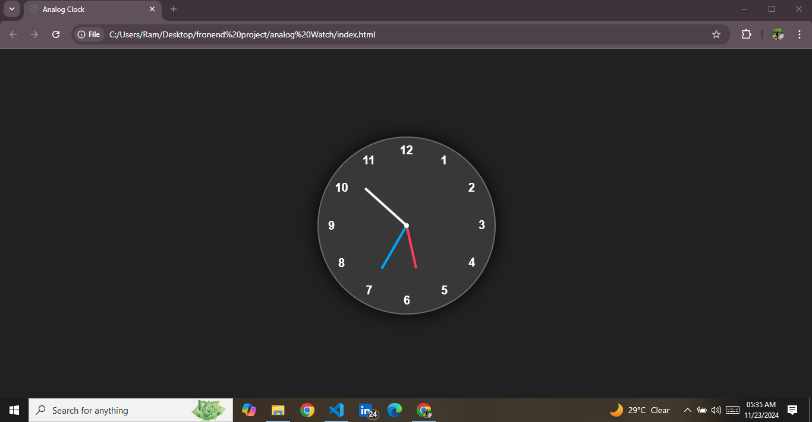

<h1>
  Analog watch
</h1>
<h3>
  Summary 
</h3>

  This analog watch, created with HTML, CSS, and JavaScript, replicates the functionality of a traditional clock in a digital format. The design includes a clock face styled with CSS for a sleek and elegant appearance. The hour, minute, and second hands dynamically move in real-time, reflecting the current time accurately.

JavaScript drives the functionality by calculating the rotation angles for each hand based on the current time and updating the positions at regular intervals. CSS ensures responsive and visually appealing styling, allowing the clock to adapt to various screen sizes seamlessly.

This project demonstrates a strong understanding of DOM manipulation, CSS animations, and JavaScript’s date and time functions. It can be enhanced further with additional features like customizable themes, time zones, or sound effects. The analog watch is a great showcase of creativity and technical skills in front-end development.

 
